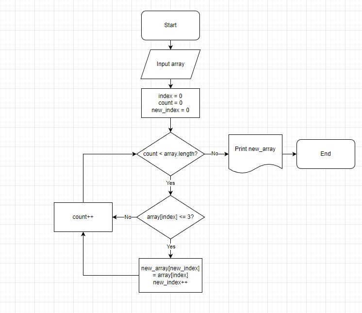

# Итоговая проверочная работа

Контрольная работа по итогу прохождения первого блока обучения на программе IT-специалист.

*Студент: Поздеева Елена.*

## Условие задачи

Написать программу, которая из имеющегося массива строк формирует массив из строк, длина которых меньше либо равна 3 символам.

## Описание решения

### **Блок-схема**

Для решения задачи была сформирована блок-схема алгоритма в соответствии с представленным рисунком.

### **Текстовое описание**

1. Ввести первоначальный массив элементов.
2. Ввести счётчик элементов массива.
3. Задать цикл, который будет сравнивать счётчик с длиной массива.
4. Если счётчик меньше длины массива, то необходимо проверить текущий элемент на выполнение условия "меньше либо равно 3 символам".
5. Если текущий элемент меньше либо равен 3 символам, то необходимо положить его в новый массив с новым индексом (первоначально равным нулю), увеличить новый индекс на 1.
6. Увеличить счётчик на 1.
7. Выполнять цикл до тех пор, пока счётчик не станет больше длины массива, тогда осуществляется выход из цикла и печать нового массива.